# Weather Hub With Arduino and ESP2866


## About Weather Hub
The progressive web application built with Laravel, Vue and OpenWeatherMap API

## Tech Stack
**Client**<br>

 

**Server**<br>


## Setup Locally

1. Clone the project

```bash
  git clone https://gitlab.ideo.pl/k.karas/weather-hub.git
```

2. Go to the project directory

```bash
  cd weahter-hub
```

3. Install dependencies

```bash
  composer install
```

```bash
  npm install
```

4. Copy the file '.env.example' and rename it to '.env', then configure it
to allow application connect with database


5. Run migrations and seeders

```bash
  php artisan migrate --seed
```

6. Generate keys

```bash
  php artisan key:generate
```

```bash
  php artisan jwt:secret
```

7. Start the Laravel server

```bash
  php artisan serve
```

8. Start the Laravel schedule worker

```bash
  php artisan schedule:work
```

9. Start the Vite server

```bash
  npm run dev
```

## Features
- Cross-platform
- Search For Place 🔍
- Create an account
- Delete user account
- Manage primary place
- Manage favourite places
- Real Time Weather Data 🌄
- Check Daily and Hourly Forecast
- Switch between temperature unit measurements
- Check out historical temperature and humidity chart for favorite places


## Screenshots


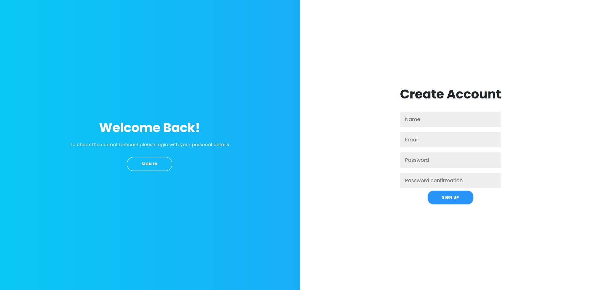

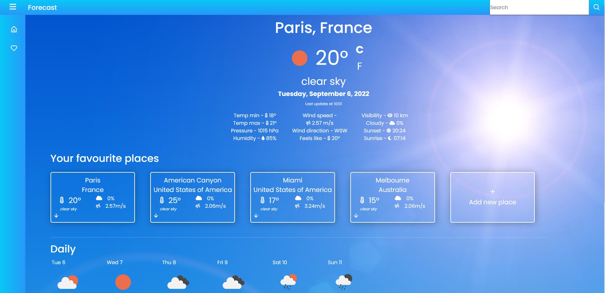

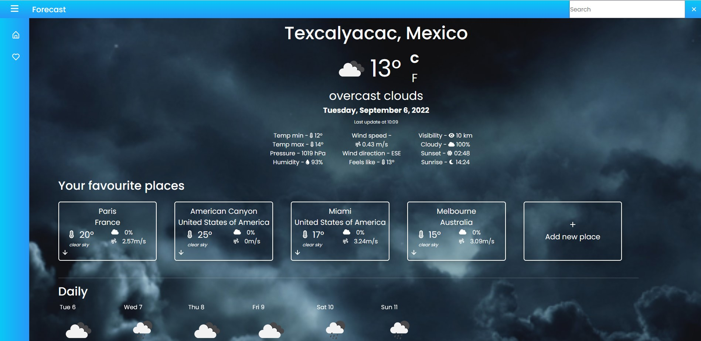

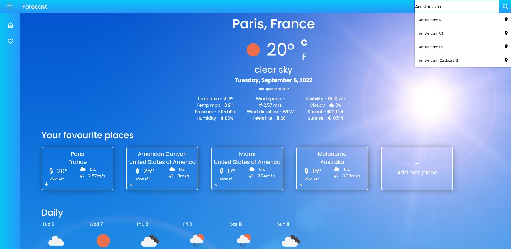

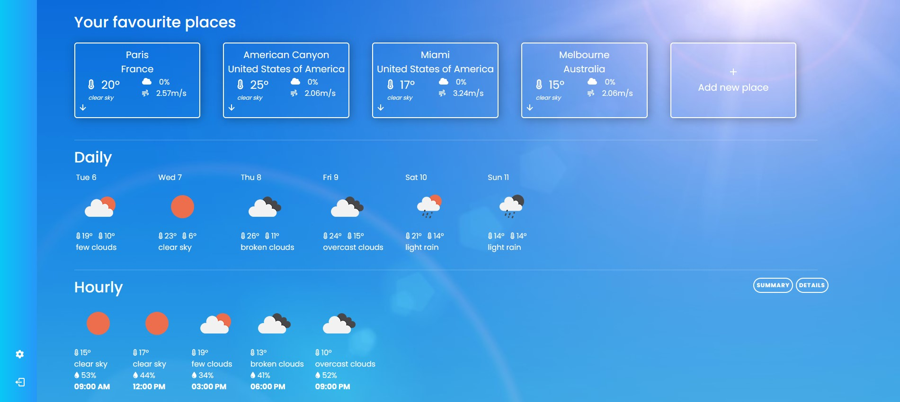

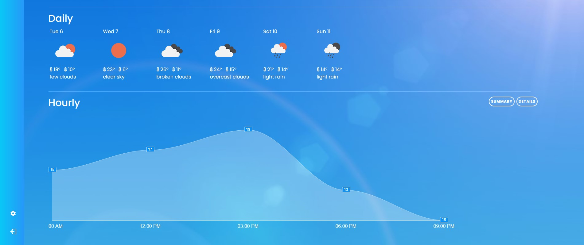

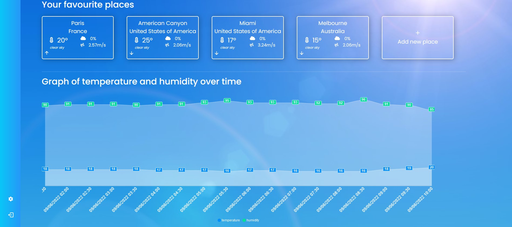

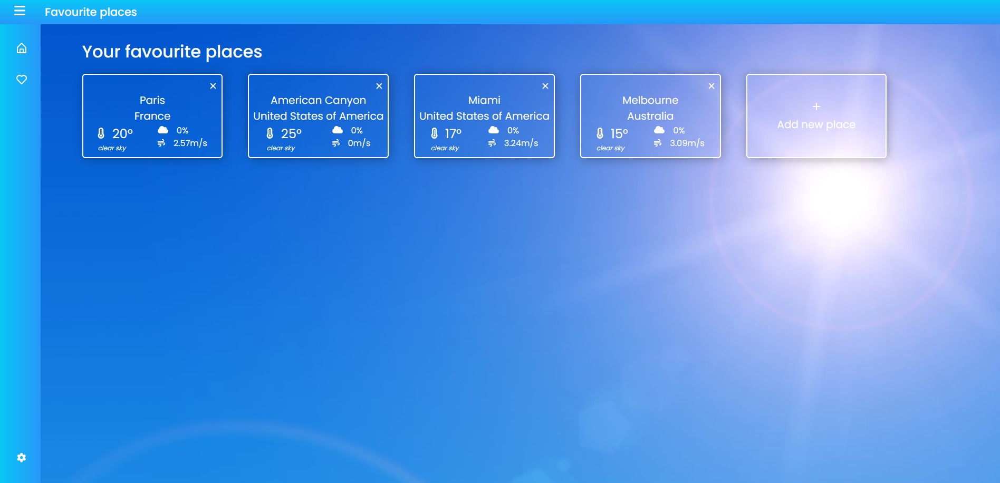

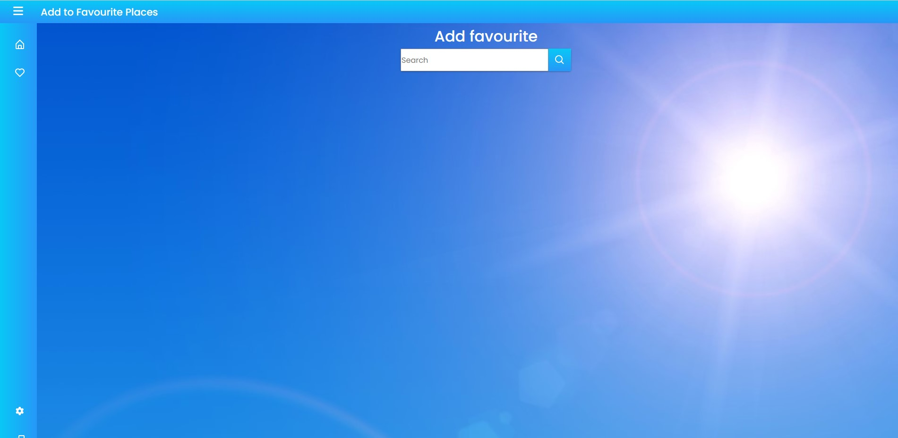

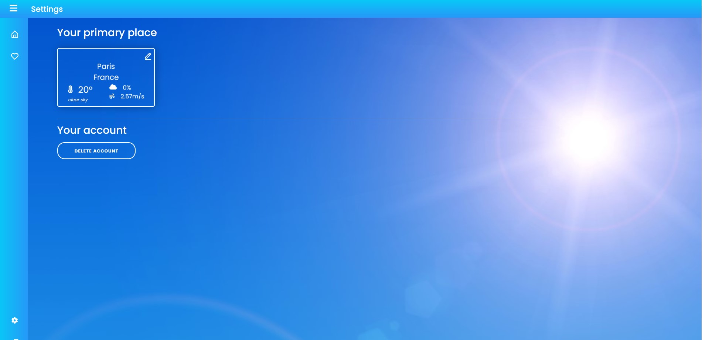

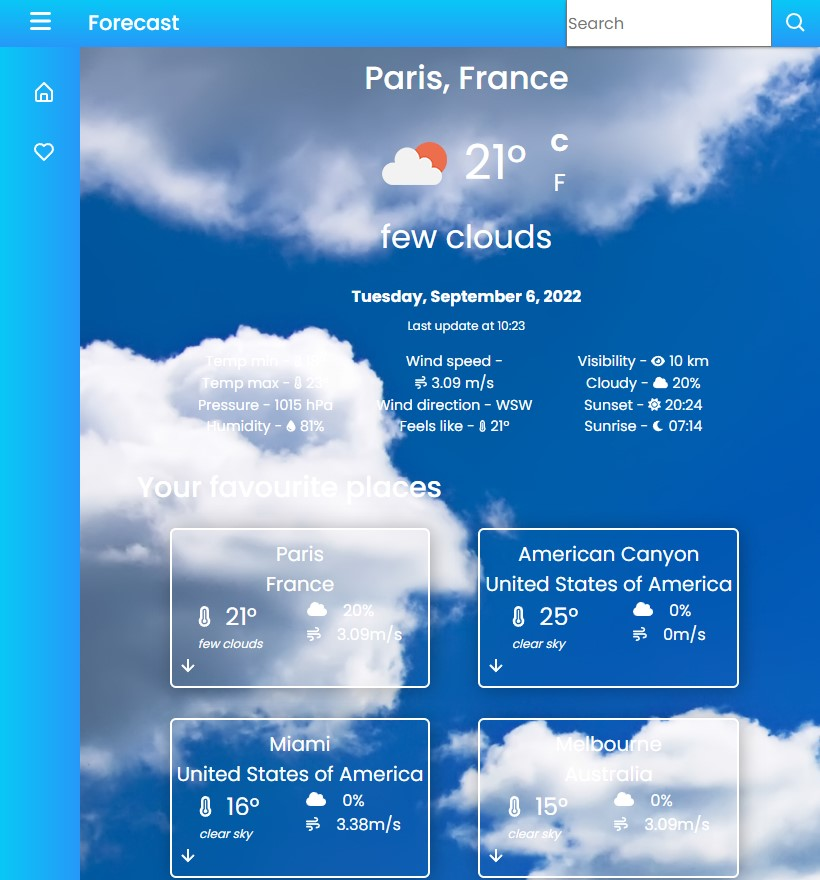

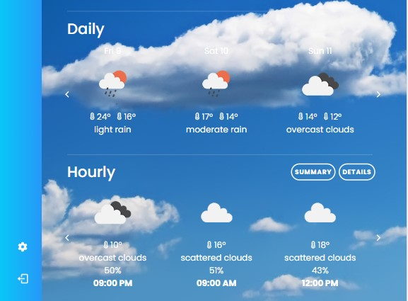


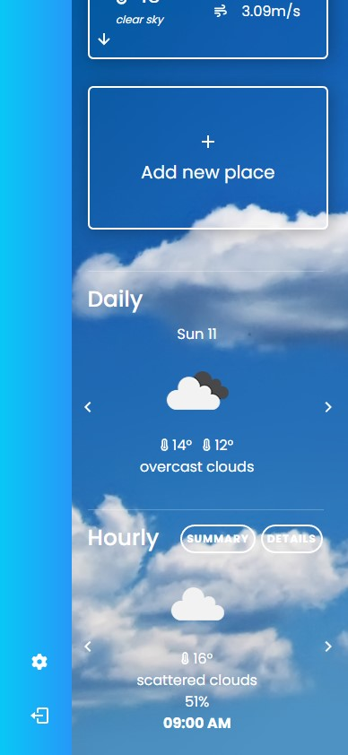

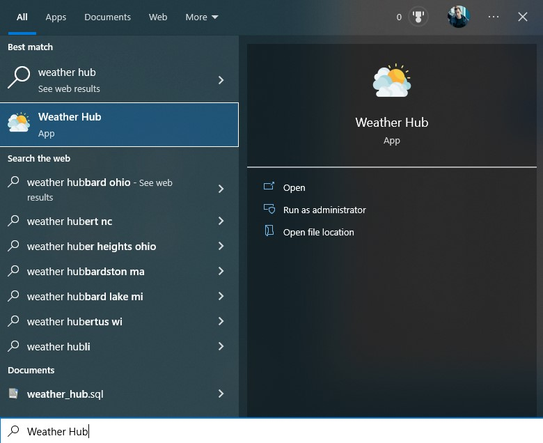

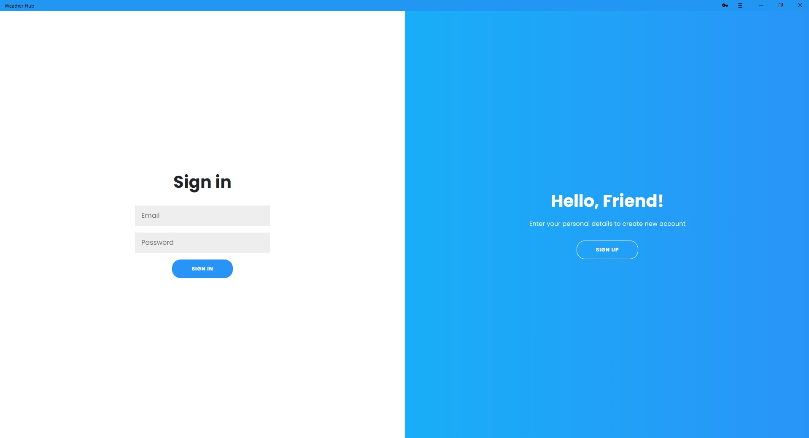


## Users already existing in the database

• Tom Cruise<br>
Email Address: ```t.cruise@gmail.com```<br>
Password: ```tcruise12?3```<br>

• Adam Lambert<br>
Email Address: ```a.lambert@gmail.com```<br>
Password: ```alambert12?3```<br>
